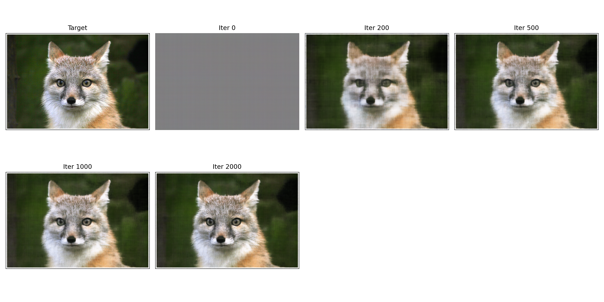
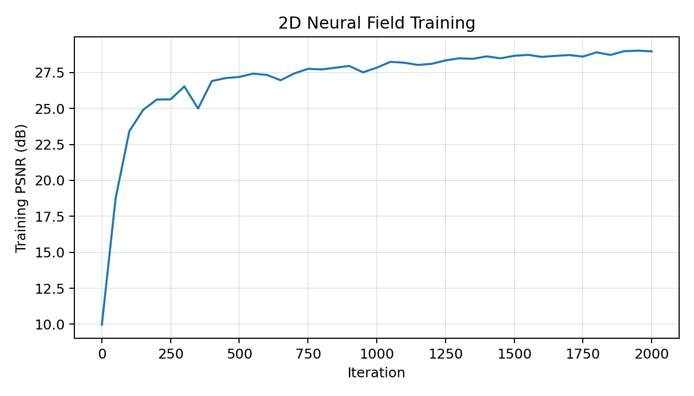
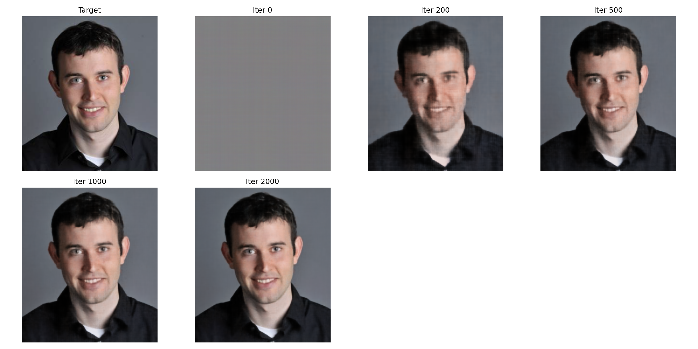
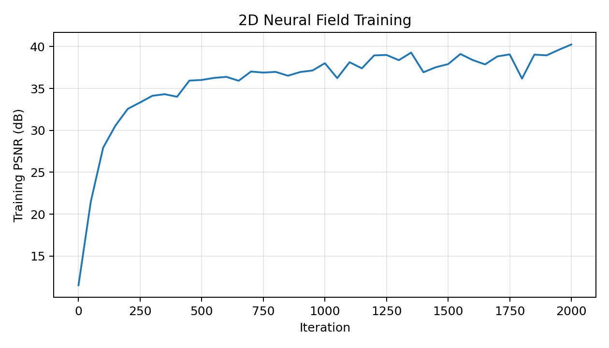
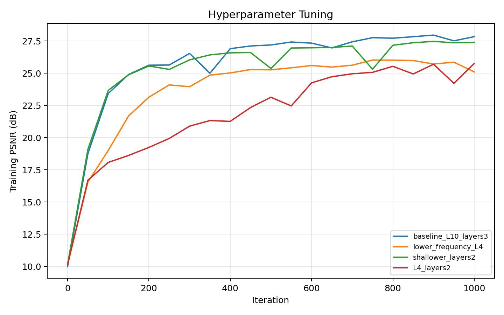
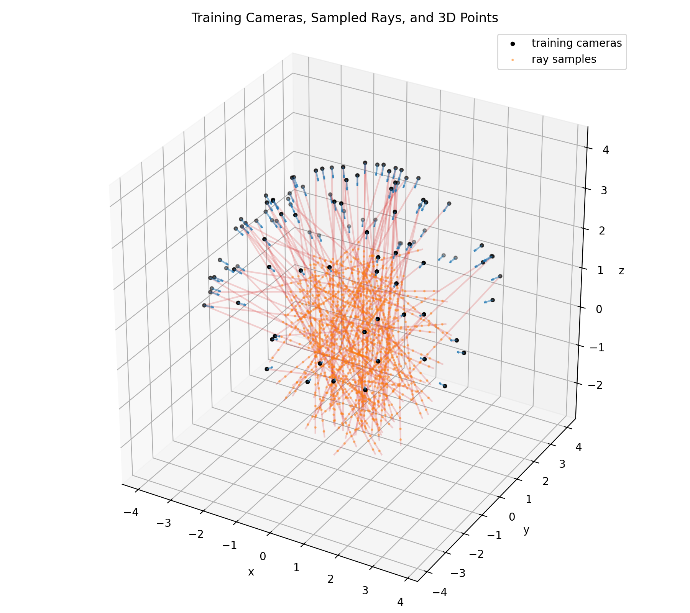
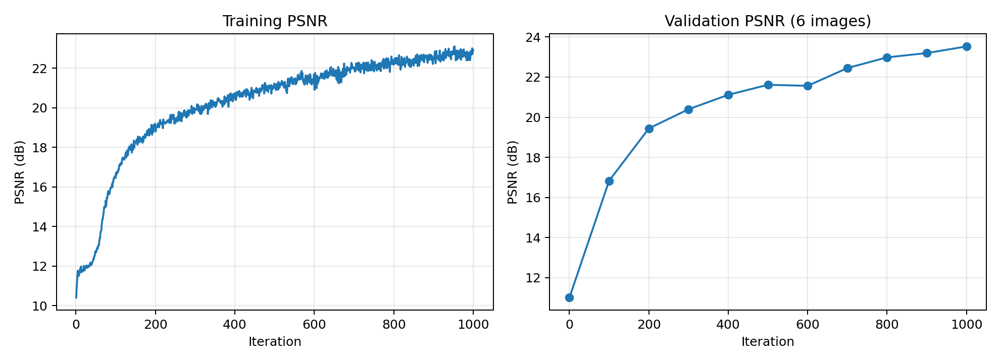

# CS180 Project 5: Neural Radiance Fields

## Part 1: Fit a Neural Field to a 2D Image

I represented each image as a continuous function from normalized pixel coordinates to RGB. The input coordinates were expanded with sinusoidal positional encoding, including the original coordinates and frequencies from 2^0 through 2^9. The baseline MLP uses three 256-channel hidden layers with ReLU activations and a final sigmoid layer. I optimized mean squared error with Adam at learning rate 1e-2, using 10,000 randomly sampled pixels per iteration.

The official cat image reached **28.97 dB PSNR**. The image from my collection reached **40.25 dB PSNR**.

### Hyperparameter tuning

I varied two hyperparameters in a small factorial experiment: the highest positional-encoding frequency (L=10 versus L=4) and network depth (three versus two hidden layers). The comparison keeps the optimizer, batch size, random seed, and image fixed.

## Part 2: Fit a Neural Radiance Field from Multi-view Images

### Ray construction and sampling

For every sampled pixel center `(u+0.5, v+0.5)`, I inverted the camera intrinsic matrix to obtain a camera-space point at unit depth, transformed it into world space with the camera-to-world matrix, and normalized the vector from the camera center to that point. During training, I sampled points in 64 stratified intervals between near=2.0 and far=6.0.

### NeRF architecture and volume rendering

The NeRF uses an eight-layer, 256-channel position MLP. Position encoding uses L=10, direction encoding uses L=4, and the encoded position is concatenated back into the network at layer four. Density is constrained nonnegative with ReLU; RGB is conditioned on direction and constrained to [0,1] with sigmoid. I used the discrete volume-rendering equation with alpha compositing and exclusive accumulated transmittance.

Training used Adam with learning rate 0.0005, an effective batch of 10000 rays, and ray microbatches of 1024 to control GPU memory. Validation PSNR over six held-out views reached **23.53 dB**.

The `validation/` directory contains predicted images across training iterations. The final spherical novel-view rendering is available as [MP4](part2/lego_novel_views.mp4) and [GIF](part2/lego_novel_views.gif).
