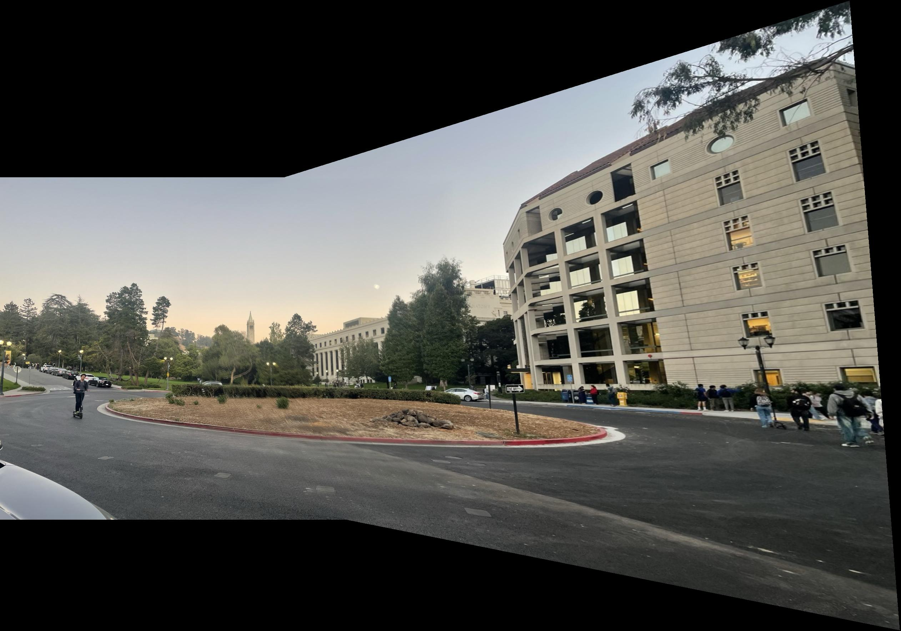
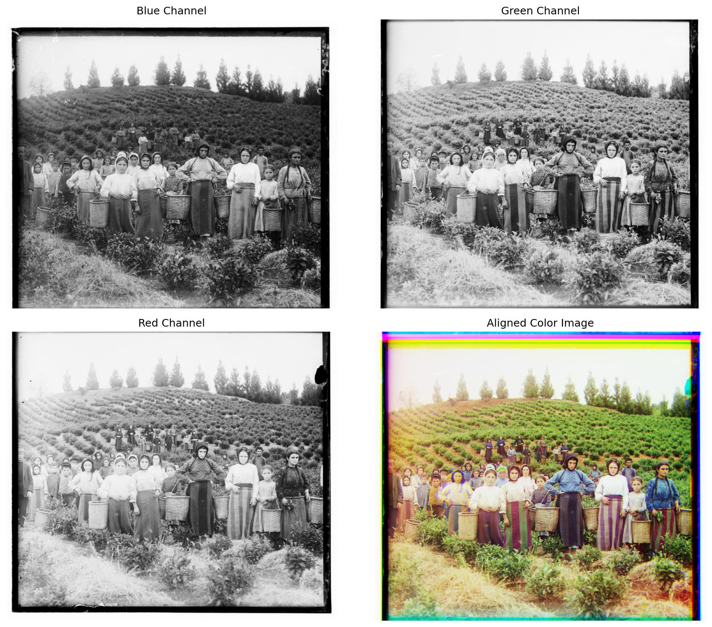
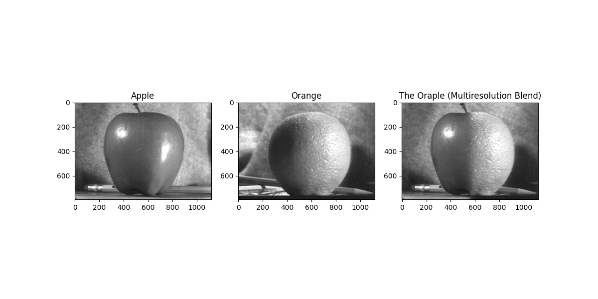
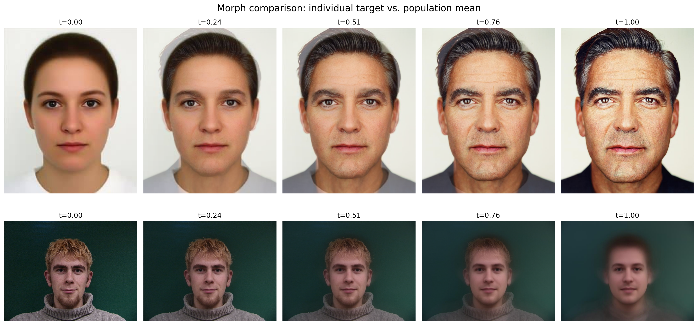
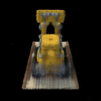

# CS180 Computer Vision Projects

Projects for UC Berkeley's **CS180: Introduction to Computer Vision and Computational Photography**.

This repository explores how images can be aligned, filtered, warped, blended, modeled as faces, and reconstructed as neural fields. Each project below includes a visual preview and a short summary of the techniques used.

<p align="center">
  
</p>

<p align="center"><em>Featured result: perspective warping and image mosaicing from Project 4.</em></p>

## Projects

<table>
  <tr>
    <td width="230" valign="top" align="center">
      <a href="Project1/README.md">
        
      </a>
    </td>
    <td valign="top">
      <h2>Project 1: Colorizing the Prokudin-Gorskii Photo Collection</h2>
      <p><a href="Project1/README.md">Project README</a></p>
      <p>
        This project reconstructs color photographs from Sergei Prokudin-Gorskii's historical glass-plate images. Each source image contains three grayscale exposures captured through blue, green, and red filters. The three channels are separated, aligned, and stacked to produce a color image.
      </p>
      <p>
        The alignment pipeline compares candidate translations with image similarity metrics such as L2 distance, normalized cross-correlation, and SSIM. Sobel edges and a coarse-to-fine image pyramid are used to make alignment more robust for high-resolution plates.
      </p>
    </td>
  </tr>
  <tr>
    <td width="230" valign="top" align="center">
      <a href="Project2/">
        
      </a>
    </td>
    <td valign="top">
      <h2>Project 2: Fun with Filters and Frequencies</h2>
      <p>
        This project studies how convolution and frequency separation can change the way images look. It implements convolution from scratch, including a vectorized two-loop version, and applies box filters, finite-difference operators, Gaussian filters, and derivative-of-Gaussian filters for smoothing and edge detection.
      </p>
      <p>
        The frequency-domain experiments sharpen blurred images, visualize Fourier spectra, and create hybrid images by combining the low frequencies of one image with the high frequencies of another. Gaussian and Laplacian stacks are then used for multiresolution image blending, including the apple-orange “oraple” result shown above.
      </p>
    </td>
  </tr>
  <tr>
    <td width="230" valign="top" align="center">
      <a href="Project3/README.md">
        
      </a>
    </td>
    <td valign="top">
      <h2>Project 3: Face Morphing and Modeling a Photo Collection</h2>
      <p><a href="Project3/README.md">Project README</a></p>
      <p>
        This project creates smooth facial transformations using manually selected facial landmarks, Delaunay triangulation, affine warping, and cross-dissolve blending. A sequence of intermediate shapes and colors is generated to produce a morph from one face to another.
      </p>
      <p>
        The project also models a collection of faces: images from the IMM Face dataset are warped to a shared mean geometry to compute a population mean face. Finally, the difference between an individual face and the population mean is extrapolated to create a caricature.
      </p>
    </td>
  </tr>
  <tr>
    <td width="230" valign="top" align="center">
      <a href="Project4/">
        
      </a>
    </td>
    <td valign="top">
      <h2>Project 4: Image Mosaics and Feature Matching</h2>
      <p>
        This project builds image mosaics in two stages. First, corresponding points are selected manually and used to estimate homographies, warp images into a common coordinate system, and blend the overlapping regions into a panorama.
      </p>
      <p>
        The autostitching extension detects Harris corners, selects well-distributed interest points with Adaptive Non-Maximal Suppression, extracts feature descriptors, matches candidate points, and uses RANSAC to estimate a robust homography. The final warped images are combined with distance-based blending to reduce visible seams.
      </p>
    </td>
  </tr>
  <tr>
    <td width="230" valign="top" align="center">
      <a href="Project5/README.md">
        
      </a>
    </td>
    <td valign="top">
      <h2>Project 5: Neural Fields and NeRF</h2>
      <p><a href="Project5/README.md">Project README</a></p>
      <p>
        This project represents images and scenes as continuous neural functions. In Part 1, a positional-encoded multilayer perceptron maps 2D pixel coordinates to RGB values. Random pixel sampling, PSNR tracking, training visualizations, and a hyperparameter sweep are used to study how the neural field fits an image.
      </p>
      <p>
        In Part 2, the project implements the building blocks of a Neural Radiance Field: camera transforms, pixel-to-ray conversion, stratified sampling along rays, a view-conditioned MLP, and differentiable volume rendering. The trained model can render validation views and synthesize novel views of a 3D object.
      </p>
    </td>
  </tr>
</table>

## Repository layout

```text
CS180-CV/
├── Project1/   # Prokudin-Gorskii colorization
├── Project2/   # Filters, frequencies, and multiresolution blending
├── Project3/   # Face morphing and face-collection modeling
├── Project4/   # Image mosaics and feature matching
├── Project5/   # Neural fields and NeRF
└── Project Website/  # React project showcase
```

> Coursework materials and implementations are provided for personal educational use. Please follow the policies of the original CS180 course when sharing or redistributing assignment materials.
